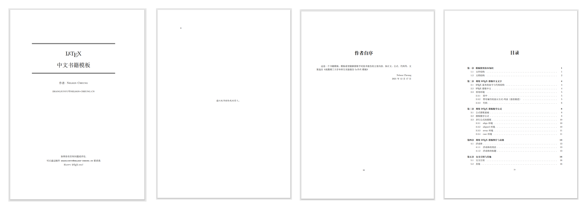
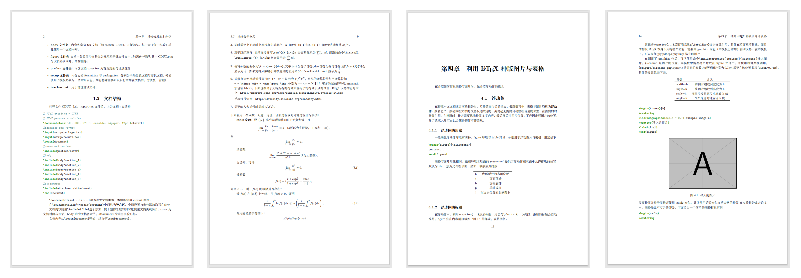

# LaTeX 中文书籍模板
> 本模板用于使用LaTeX排版中文书籍。
# Quick Start
首先下载并安装[texlive 2021](https://www.tug.org/texlive/)，安装[minted](https://ctan.org/pkg/minted?lang=en)包，然后执行如下命令。
```shell
git clone git@github.com:NelsonCheung-cn/latex-book-template.git
cd latex-book-template
xelatex -shell-escape book.tex
xelatex -shell-escape book.tex
```
生成的[book.pdf](book.pdf)为模板示例。

部分效果如下(github的内嵌pdf显示器可能无法显示中文......)。





# Introduction
本模板使用`ctexbook`作为`documentclass`，见`book.tex`，如下所示。
```latex
\documentclass[openany,10pt,UTF-8,CJK,GBK]{ctexbook}

\usepackage[a4paper,twoside,width=15cm]{geometry}

\include{package.tex}

\begin{document}

\frontmatter

\include{title.tex}

\vspace*{\fill}
    \begin{center}
        \textit{谨以此书献给我的家人。}
    \end{center}
\vspace*{\fill}

\include{preface.tex}

\tableofcontents

\mainmatter

\include{chapter_1.tex}
\include{chapter_2.tex}
\include{chapter_3.tex}
\include{chapter_4.tex}
\include{chapter_5.tex}
\include{chapter_6.tex}

\include{attachment.tex}

\end{document}
```

由于书籍模板常用于排版大量文字，模板的每一个部分通过`\include`命令包含进来，`\inculde`命令包含的`tex`文件如下所示。
+ `package.tex`：模板用到的包。
+ `title.tex`：标题。
+ `preface.tex`：前言。
+ `chapter_X.tex`：第X章的内容。
+ `attachment.tex`：附录。

本模板的文案选自成都理工提供的LaTeX模板，生成的`book.pdf`中的某些细节可能和模板的实际代码有所出入，详情以源码为准。

# References
1. 成都理工学院实验报告模板 [[DOWNLOAD](http://static.latexstudio.net/article/2019/0324/CDUT_Lab_report.rar)]
2. Elegantbook [[GITHUB](https://github.com/ElegantLaTeX/ElegantBook)] 
3. Book Class: Instructor's Guide [[LINK](https://tex.stackexchange.com/questions/159746/book-class-instructors-guide)]